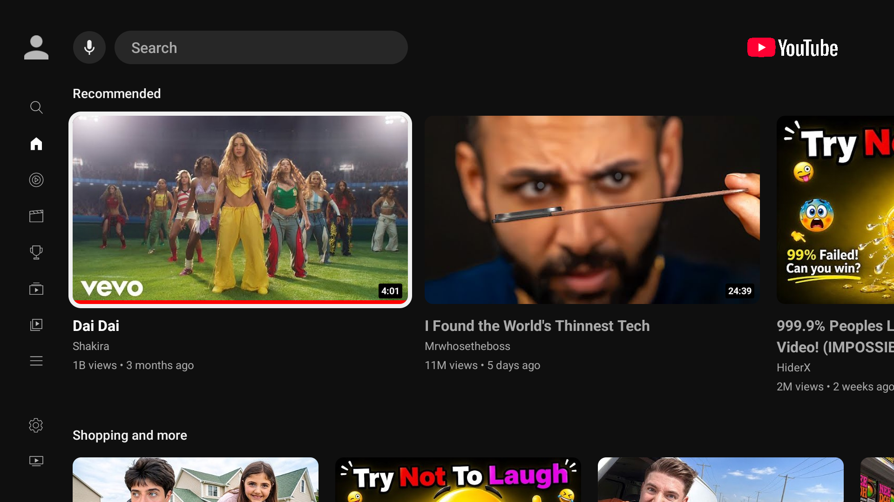
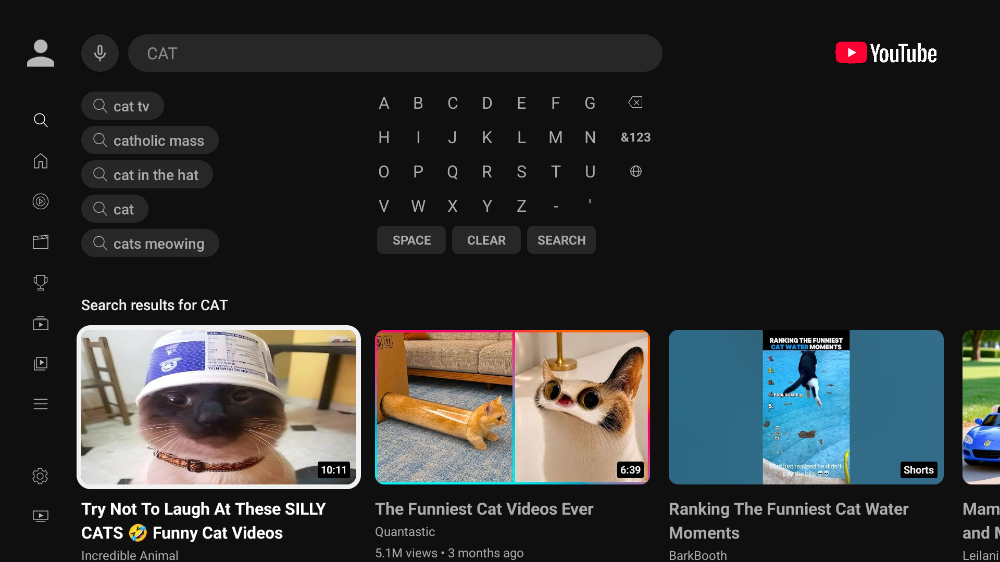
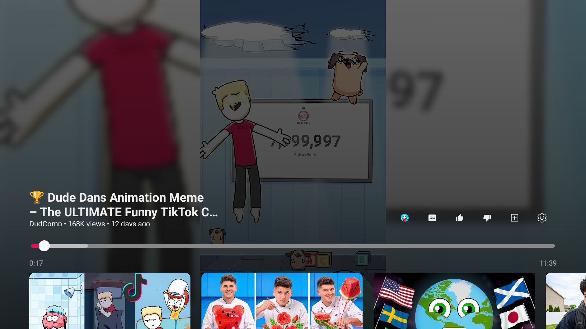

# SmartTube · Mikel

**Mi versión personal de SmartTube para Android TV y Google TV, con una interfaz inspirada en YouTube para TV.**

[⬇ Descargar para la TV](https://github.com/Mikelteller4/SmartTube/releases/latest) · [Proyecto original](https://github.com/yuliskov/SmartTube) · [Estado visual](TV-FIDELITY.md)



## Qué ofrece

| 📺 Para el sofá | 🔎 Encuentra vídeos | ▶ Reproduce |
| --- | --- | --- |
| Inicio con tarjetas grandes y navegación con el mando. | Teclado en pantalla, búsqueda e historial. | Controles adaptados al televisor y funciones de SmartTube. |

| Búsqueda | Reproductor |
| --- | --- |
|  |  |

## Qué cambia en mi versión

- Interfaz adaptada: inicio, barra lateral, búsqueda, música, selector de cuenta y reproductor.
- Caché de imágenes más contenida en televisores con hasta 2 GB de RAM o marcados por Android como dispositivos con poca memoria.
- Cancelación de cargas de imágenes al reciclar canales y cabeceras; miniaturas alternativas limitadas al tamaño de su tarjeta.
- Identidad propia: **SmartTube · Mikel**, mantenido por [Mikelteller4](https://github.com/Mikelteller4).

Las optimizaciones conservan el diseño y las animaciones. La mejora de velocidad aún debe medirse en el televisor real; no se promete una cifra. Movies queda fuera del trabajo de fidelidad. Es una adaptación visual en desarrollo, no un calco exacto verificado de todas las pantallas.

## Instalación

1. Abre la [última versión publicada](https://github.com/Mikelteller4/SmartTube/releases/latest).
2. Descarga **SmartTube-Private-TV-arm.apk** para tu TV Android/Google TV. La APK x86 es para el emulador del ordenador.
3. Abre la APK y permite la instalación desde esa aplicación cuando Google TV lo solicite.

El identificador sigue siendo `app.smarttube.private.tv`, para actualizar la instalación anterior conservando sus datos cuando coincida la firma. El nombre histórico del archivo APK se mantiene para conservar los enlaces de descarga.

## Compilar

Java 17 y Android SDK con las versiones indicadas en Gradle. Configura `ANDROID_HOME` o `local.properties` y clona también los submódulos:

```sh
git clone --recurse-submodules --branch private/youtube-tv-interface https://github.com/Mikelteller4/SmartTube.git
cd SmartTube
./gradlew :smarttubetv:assembleStfdroidOptimized
```

La variante `optimized` desactiva la depuración y aplica R8 y reducción de recursos. Usa la clave local de depuración para mantener la compatibilidad con las APK de prueba anteriores de este fork; una compilación en otro ordenador tendrá otra firma. No se publica ninguna clave privada.

## Créditos

Basado en [SmartTube de yuliskov y sus colaboradores](https://github.com/yuliskov/SmartTube). Se conservan su licencia y los avisos originales; consulta también el [README original](README.upstream.md). Las capturas muestran esta adaptación; el contenido recomendado cambia con el servicio.

Proyecto independiente, sin afiliación con Google ni YouTube. Las marcas pertenecen a sus titulares.
